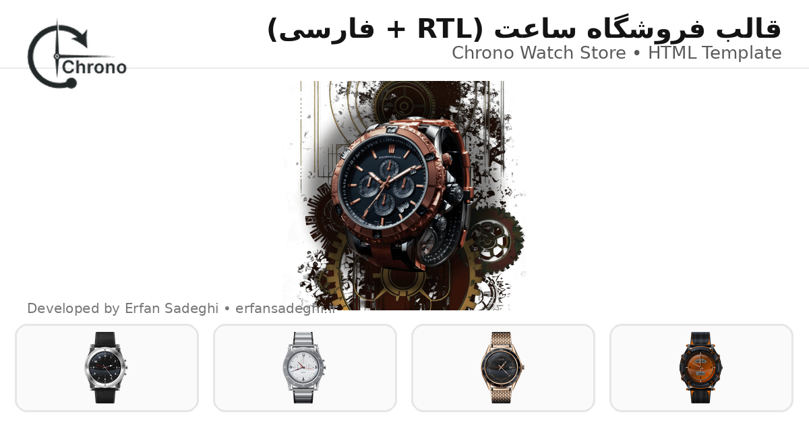

# ⌚ Chrono Watch Store — قالب فروشگاه ساعت (RTL + فارسی)

  

  قالب فروشگاه ساعت با <b>راست‌چین کامل (RTL)</b> و <b>فارسی‌سازی شده</b> — آماده برای استفاده روی هاست یا انتشار در GitHub Pages

---

## ✨ ویژگی‌ها
- ✅ **RTL کامل** (`dir="rtl"` + `lang="fa"`)
- ✅ **فارسی‌سازی** متن‌های رابط کاربری
- ✅ رفع مشکل گیر کردن روی **Loading / Preloader**
- ✅ پاکسازی لینک‌ها/فایل‌های اضافی و خراب
- ✅ آماده برای دیپلوی روی **GitHub Pages** یا هاست

---

## 🖼️ پیش‌نمایش (Preview)
> اگر فایل تصویر را داخل ریپو گذاشتی، اینجا نمایش داده می‌شود.

  

---

## 🚀 شروع سریع (Quick Start)

### 1) اجرای لوکال
فایل `index.html` را مستقیم باز کن یا با Live Server اجرا کن:

- VS Code → افزونه **Live Server** → Run

### 2) انتشار روی GitHub Pages
1) برو به **Settings** ریپو  
2) بخش **Pages**  
3) Source را روی **Deploy from a branch** بگذار  
4) Branch: `main` و Folder: `/ (root)`  
5) Save → لینک سایت ساخته می‌شود ✅

---

## 📁 ساختار فایل‌ها
- `assets/css/rtl-fa.css`  
  استایل‌های RTL و ریزتنظیمات فارسی (بدون دستکاری زیاد قالب اصلی)

- `assets/js/app.js`  
  اسکریپت اصلی مدیریت **Preloader/Loading**  
  (حتی اگر اسکریپت‌های دیگر مشکل داشته باشند، صفحه را از حالت لودینگ خارج می‌کند)

---

## 🎨 شخصی‌سازی (Customization)

### تغییر نام/لینک سازنده
در فایل‌های HTML (معمولاً فوتر) دنبال این‌ها بگرد:
- `عرفان صادقی`
- `erfansadeghi.ir`

و تغییر بده.

### تغییر رنگ‌ها
- `assets/css/app.css`

### RTL و فارسی
- `assets/css/rtl-fa.css`

### تغییر فونت
اگر فونت اضافه کردی:
- فونت را داخل `assets/fonts/` قرار بده  
- و در `rtl-fa.css` یا `app.css` به `font-family` اضافه کن.

---

## 🧩 نکات و پیشنهادها
- این پروژه یک قالب HTML است؛ می‌توانی برای نسخه حرفه‌ای‌تر آن را روی سیستم‌ها/فریم‌ورک‌ها پیاده‌سازی کنی:
  - Laravel / Next.js / WordPress / …
- اگر بخواهی ظاهر را به قالب‌های دیگر نزدیک کنی، با تغییر **تایپوگرافی، هدر، کارت محصول، فاصله‌ها** می‌شود انجام داد (بدون کپی ۱به۱).

---

## 🧯 رفع مشکل (Troubleshooting)
**اگر صفحه روی Loading گیر کرد:**
- مطمئن شو فایل `assets/js/app.js` درست لود می‌شود
- و مسیر فایل‌ها (css/js/images) درست است (Relative path)

---

## 👤 سازنده
**عرفان صادقی**  
🌐 https://erfansadeghi.ir

---

## 📄 License
اگر دوست داری پروژه‌ات لایسنس داشته باشه (پیشنهادی: MIT) بگو تا فایل `LICENSE` هم برات آماده کنم.
